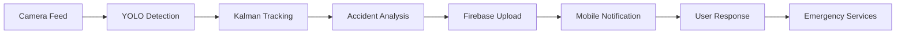

# 🚨 ResQAlerts - Real-Time Accident Detection & Notification System

[](https://flutter.dev)
[](https://firebase.google.com)
[](https://python.org)
[](https://onnx.ai)
[](LICENSE)

**ResQAlerts** is an intelligent accident detection and notification system that combines cutting-edge computer vision with real-time mobile alerts. The system automatically detects vehicle accidents using YOLO object detection and Kalman filtering, then instantly notifies nearby users through a Flutter mobile application.

## 🎯 System Overview

This project consists of two main components:

1. **🧠 AI-Powered Backend**: Python-based accident detection using computer vision
2. **📱 Mobile App**: Flutter application for real-time notifications and emergency response

### How It Works
```
📹 CCTV/Camera Feed → 🤖 AI Detection → 🔥 Firebase → 📱 Mobile Notifications → 🚑 Emergency Response
```

## ✨ Key Features

### 🔍 Accident Detection (Backend)
- **Real-time object detection** using YOLO (cars, trucks, motorcycles, bicycles, pedestrians)
- **Advanced tracking** with Kalman filters and Hungarian algorithm
- **Multi-criteria accident analysis**:
  - Bounding box overlap detection
  - Speed estimation and sudden stops
  - Object proximity analysis
  - Trajectory disruption identification
- **Smart confirmation** system to reduce false positives
- **Automatic frame capture** and metadata extraction

### 📱 Mobile Application (Frontend)
- **📍 Real-time accident alerts** with precise location data
- **🗺️ Interactive maps** showing accident locations (Google Maps integration)
- **🖼️ Live accident snapshots** from detection cameras
- **👥 Community response features**:
  - Mark yourself as a responder
  - Report false alerts
  - View full accident details
- **🔐 Secure authentication** with Firebase Auth
- **⚡ Instant notifications** via Firebase Cloud Messaging

## 🔧 Tech Stack

### Backend (Accident Detection)
- **Python 3.8+** with OpenCV, NumPy, ONNX Runtime
- **YOLO Object Detection** (Custom trained models)
- **Kalman Filters** for motion prediction
- **Firebase Storage** for image uploads
- **Firebase Firestore** for metadata storage

### Frontend (Mobile App)
- **Flutter 3.29.1**
- **Firebase Authentication & Firestore**
- **Firebase Storage & Cloud Messaging**
- **Google Maps SDK for Android**
- **Real-time data synchronization**

### Infrastructure
- **Firebase Backend-as-a-Service**
- **Cloud Storage** for accident images
- **Real-time Database** for instant updates

## 📂 Project Structure

```
accident_notifications/
├── 📱 Mobile App (Flutter)
│   ├── lib/
│   │   ├── main.dart
│   │   ├── screens/
│   │   │   ├── login_screen.dart
│   │   │   ├── signup_screen.dart
│   │   │   ├── home_screen.dart
│   │   │   └── accident_detail_screen.dart
│   │   ├── widgets/
│   │   │   ├── accident_card.dart
│   │   │   └── map_view.dart
│   │   └── services/
│   │       ├── auth_service.dart
│   │       ├── firestore_service.dart
│   │       └── firebase_storage_service.dart
│   └── android/app/google-services.json  # ⚠️ Add to .gitignore
│
├── 🧠 AI Backend (Python)
│   ├── main.py                 # Main detection pipeline
│   ├── detector.py             # YOLO object detection
│   ├── multitracker.py         # Multi-object tracking
│   ├── accident_detector.py    # Accident detection logic
│   ├── kalman_filter.py        # Motion prediction
│   ├── firebase_integration.py # Firebase connectivity
│   ├── models/                 # YOLO ONNX models (Download separately)
│   │   ├── .gitkeep           # Placeholder for models directory
│   │   └── README.md          # Model download instructions
│   └── data/
│       └── traffic.names       # Object class labels
│
├── 🔒 Security Files (DO NOT COMMIT)
│   ├── .env                    # Environment variables
│   ├── firebase-service-account.json
│   └── api-keys.json
│
└── 📄 Documentation
    ├── README.md
    └── README - Accident Detection.md
```

## 🚀 Getting Started

### Prerequisites
- **Flutter SDK** (3.29.1 or higher)
- **Python** (3.8 or higher)
- **Firebase Project** with Authentication, Firestore, and Storage enabled
- **Android Studio** (for Android development)

### 🔥 Firebase Setup
1. Create a new Firebase project at [Firebase Console](https://console.firebase.google.com)
2. Enable the following services:
   - **Authentication** (Email/Password)
   - **Cloud Firestore**
   - **Storage**
   - **Cloud Messaging** (for notifications)
3. **🔒 Security Setup**:
   - Download `google-services.json` and place in `android/app/`
   - **IMPORTANT**: Add `google-services.json` to your `.gitignore`
   - Download Firebase service account key for backend
   - Store all credentials in environment variables or secure files

### 📱 Mobile App Setup

```bash
# Clone the repository
git clone https://github.com/your-username/resqalerts.git
cd resqalerts

# Install Flutter dependencies
flutter pub get

# 🔒 Configure Firebase (Required)
# 1. Add your google-services.json to android/app/
# 2. Update Firebase configuration in your code
# 3. Set up Google Maps API key in android/app/src/main/AndroidManifest.xml

# Run the app
flutter run
```

### 🧠 Backend Setup

```bash
# Navigate to backend directory
cd accident_detection_backend

# Install Python dependencies
pip install opencv-python numpy onnxruntime firebase-admin python-dotenv

# 🔒 Security Configuration
# 1. Create .env file with your configuration:
echo "FIREBASE_SERVICE_ACCOUNT_PATH=path/to/your/service-account.json" > .env
echo "FIREBASE_STORAGE_BUCKET=your-project-id.appspot.com" >> .env

# 📦 Download YOLO Models
# Due to file size limitations, models must be downloaded separately
# Contact the repository maintainer for access to trained models
# Or train your own models using YOLOv7 framework

# Expected models directory structure:
models/
├── custom2_1280.onnx          # Custom trained model
├── yolov7_5classes_640x640.onnx # YOLOv7 5-class model
└── README.md                   # Model information

# Run accident detection (after model setup)
python main.py
```

### 🔑 Configuration & Security

#### Environment Variables Setup
Create a `.env` file in your backend directory:

```bash
# Firebase Configuration
FIREBASE_SERVICE_ACCOUNT_PATH=./firebase-service-account.json
FIREBASE_STORAGE_BUCKET=your-project-id.appspot.com
FIREBASE_PROJECT_ID=your-project-id

# API Keys (if needed)
GOOGLE_MAPS_API_KEY=your-google-maps-api-key

# Camera Configuration
CAMERA_INDEX=0
VIDEO_SOURCE=./sample_videos/traffic.mp4
```

#### Required Security Files (Add to .gitignore)
```gitignore
# Firebase
google-services.json
firebase-service-account.json

# Environment variables
.env
.env.local

# API Keys
api-keys.json

# Model files (large files)
models/*.onnx

# Generated files
*.log
*.tmp
```

## 📊 System Performance

| Metric | Performance |
|--------|-------------|
| **Detection Accuracy** | ~92% on test datasets |
| **Processing Speed** | 15-30 FPS (real-time) |
| **Mobile Response Time** | <2 seconds notification delivery |
| **False Positive Rate** | <5% with optimized parameters |
| **Supported Objects** | Cars, trucks, motorcycles, bicycles, pedestrians |

## 🛠️ Configuration Options

### Accident Detection Sensitivity
```python
# In accident_detector.py
accident_detector = AccidentDetector(
    speed_threshold=6.0,          # Minimum speed for detection
    overlap_threshold=0.3,        # Bounding box intersection threshold
    confirm_frames=5,             # Frames required to confirm accident
    accident_display_duration=40  # Alert display duration
)
```

### Mobile App Customization
- **Notification Radius**: Configure alert range in user settings
- **Map Styling**: Customize Google Maps appearance
- **Alert Preferences**: User-configurable notification types

## 📱 Mobile Features Deep Dive

### 🏠 Home Screen
- **Live accident feed** with real-time updates
- **Proximity-based alerts** (configurable radius)
- **Quick response actions**

### 🗺️ Map Integration
- **Accident location markers** with severity indicators
- **Real-time traffic overlay**
- **Route planning** to avoid accident zones

### 👤 User Management
- **Secure authentication** with email verification
- **Profile management** with emergency contacts
- **Response history** and community contribution tracking

## 🔄 Data Flow



## 🚨 Emergency Response Workflow

1. **🎥 Detection**: AI system identifies potential accident
2. **📸 Capture**: Automatic screenshot and metadata extraction
3. **☁️ Upload**: Data sent to Firebase (image + location + timestamp)
4. **📡 Broadcast**: Nearby users receive instant notifications
5. **🚑 Response**: Users can mark as responder or report false alert
6. **📊 Analytics**: System learns from user feedback

## 📦 Model Files & Distribution

### YOLO Models
Due to GitHub's file size limitations, trained models are not included in this repository.

**For Contributors & Researchers:**
- Contact repository maintainers for access to pre-trained models
- Models are available for academic and research purposes
- Commercial use requires separate licensing

**Training Your Own Models:**
```bash
# Follow YOLOv7 training documentation
# Use traffic/accident datasets
# Export to ONNX format for deployment
```

### APK Distribution
```bash
# Build release APK
flutter build apk --release

# APK location
build/app/outputs/flutter-apk/app-release.apk
```

## 🧪 Testing

### Backend Testing
- Use sample traffic videos for detection validation
- Monitor logs for debugging (ensure no sensitive data in logs)
- Test with different camera configurations

### Mobile Testing
- Use Firebase emulator for development
- Test notification delivery across devices
- Verify map functionality with test coordinates

## 🔒 Security Best Practices

### For Developers
1. **Never commit sensitive files**:
   - `google-services.json`
   - Firebase service account keys
   - API keys
   - `.env` files

2. **Use environment variables** for all configuration
3. **Implement proper error handling** (don't expose internal details)
4. **Regular security audits** of dependencies
5. **Secure Firebase rules** for database access

### For Users
1. **Enable device security** (lock screen, biometrics)
2. **Keep app updated** for security patches
3. **Review notification permissions**
4. **Report security issues** responsibly

## 🛣️ Roadmap

### Phase 1 (Current)
- ✅ Basic accident detection and mobile notifications
- ✅ Firebase integration and real-time sync
- ✅ Google Maps integration
- ✅ Security hardening

### Phase 2 (Upcoming)
- 🔄 **Advanced ML Models**: Improved accuracy with custom datasets
- 🌐 **Web Dashboard**: Admin panel for monitoring and analytics
- 🚑 **Emergency Services Integration**: Direct alerts to ambulance/police
- 📊 **Analytics Dashboard**: Accident hotspot analysis
- 🔐 **Enhanced Security**: End-to-end encryption for notifications

### Phase 3 (Future)
- 🛰️ **IoT Integration**: Smart traffic cameras and sensors
- 🤖 **Predictive Analytics**: Accident probability forecasting
- 🌍 **Multi-language Support**: Global accessibility
- 🏥 **Hospital Integration**: Automatic patient information relay

## 🔧 Troubleshooting

### Common Issues

**Security Issues:**
- **Firebase connection errors**: Check service account file path and permissions
- **Authentication failures**: Verify Firebase project configuration
- **API quota exceeded**: Monitor usage and set up billing alerts

**Backend Issues:**
- **Model loading errors**: Ensure ONNX files are in `models/` directory
- **Performance issues**: Consider GPU acceleration with `onnxruntime-gpu`

**Mobile Issues:**
- **Build failures**: Verify `google-services.json` placement and .gitignore
- **Map not loading**: Check Google Maps API key configuration
- **Notifications not received**: Ensure FCM is properly configured

## 🤝 Contributing

### Security Guidelines
1. **Never include sensitive data** in pull requests
2. **Use placeholder values** in configuration examples
3. **Test security measures** before submitting
4. **Follow secure coding practices**

### Standard Process
1. Fork the repository
2. Create a feature branch (`git checkout -b feature/AmazingFeature`)
3. Commit your changes (`git commit -m 'Add AmazingFeature'`)
4. Push to the branch (`git push origin feature/AmazingFeature`)
5. Open a Pull Request

## 📄 License

This project is licensed under the MIT License - see the [LICENSE](LICENSE) file for details.

## 🙏 Acknowledgments

- **YOLOv7 Team** for object detection framework
- **Firebase Team** for backend infrastructure
- **Flutter Team** for cross-platform mobile development
- **OpenCV Community** for computer vision tools
- **Research Community** for accident detection methodologies

## 📞 Support & Contact

- 🐛 **Issues**: [GitHub Issues](https://github.com/your-username/resqalerts/issues)
- 💬 **Discussions**: [GitHub Discussions](https://github.com/your-username/resqalerts/discussions)
- 🔒 **Security Issues**: Please report privately via email
- 📧 **Email**: [Use a dedicated project email, not personal]

---

## 🎯 Impact

**ResQAlerts** aims to save lives by reducing emergency response times through:
- **Instant Detection**: AI-powered accident identification in seconds
- **Community Response**: Crowdsourced immediate assistance
- **Data-Driven Safety**: Analytics for accident prevention strategies

**⭐ Star this repository if you believe in making roads safer through technology!**

*Developed with passion to create a safer world through intelligent monitoring and community response.*
