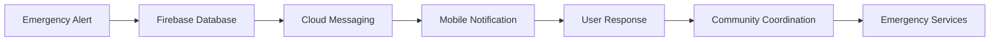

# ResQAlerts - Emergency Notification Mobile App

[](https://flutter.dev)
[](https://firebase.google.com)
[](LICENSE)

**ResQAlerts** is a Flutter-based mobile application for real-time emergency notifications and community response coordination. The app enables users to receive instant alerts about nearby emergencies and coordinate community response efforts.

## 🎯 App Overview

ResQAlerts is a mobile notification system that connects community members during emergency situations, enabling faster response times and better coordination of assistance efforts.

### How It Works
```
🚨 Emergency Alert → 📱 Mobile Notification → 👥 Community Response → 🚑 Emergency Services
```

## ✨ Key Features

### 📱 Core Functionality
- **📍 Real-time emergency alerts** with precise location data
- **🗺️ Interactive maps** showing emergency locations (Google Maps integration)
- **🖼️ Emergency snapshots** and incident details
- **👥 Community response features**:
  - Mark yourself as a responder
  - Report incidents
  - View emergency details
  - Coordinate with other responders
- **🔐 Secure authentication** with Firebase Auth
- **⚡ Instant notifications** via Firebase Cloud Messaging
- **📊 Response tracking** and incident history

## 🔧 Tech Stack

### Mobile App
- **Flutter 3.29.1** - Cross-platform mobile framework
- **Firebase Authentication** - User management and security
- **Cloud Firestore** - Real-time database
- **Firebase Storage** - Image and file storage
- **Firebase Cloud Messaging** - Push notifications
- **Google Maps SDK** - Location services and mapping
- **Material Design 3** - Modern UI components

### Services & Integrations
- **Firebase Backend-as-a-Service** - Complete backend solution
- **Google Maps Platform** - Location and mapping services
- **Firebase Analytics** - App usage insights

## 📂 Project Structure

```
resq_alerts/
├── 📱 lib/
│   ├── main.dart                    # App entry point
│   ├── screens/                     # UI Screens
│   │   ├── login_screen.dart
│   │   ├── signup_screen.dart
│   │   ├── home_screen.dart
│   │   ├── map_screen.dart
│   │   ├── profile_screen.dart
│   │   └── emergency_detail_screen.dart
│   ├── widgets/                     # Reusable UI components
│   │   ├── emergency_card.dart
│   │   ├── map_view.dart
│   │   ├── response_button.dart
│   │   └── notification_badge.dart
│   ├── services/                    # Business logic
│   │   ├── auth_service.dart
│   │   ├── firestore_service.dart
│   │   ├── storage_service.dart
│   │   ├── notification_service.dart
│   │   └── location_service.dart
│   ├── models/                      # Data models
│   │   ├── emergency_model.dart
│   │   ├── user_model.dart
│   │   └── response_model.dart
│   └── utils/                       # Utilities and constants
│       ├── constants.dart
│       ├── helpers.dart
│       └── theme.dart
├── 📁 android/                      # Android-specific configuration
├── 📁 ios/                          # iOS-specific configuration
├── 📄 pubspec.yaml                  # Dependencies and app metadata
└── 📄 README.md                     # Project documentation
```

## 🚀 Getting Started

### Prerequisites
- **Flutter SDK** (3.29.1 or higher)
- **Android Studio** or **VS Code** with Flutter plugins
- **Firebase Project** with required services enabled
- **Google Maps API** access for location services

### 🔥 Firebase Setup
1. Create a new Firebase project at [Firebase Console](https://console.firebase.google.com)
2. Enable the following services:
   - **Authentication** (Email/Password and Google Sign-In)
   - **Cloud Firestore** (Real-time database)
   - **Storage** (File uploads)
   - **Cloud Messaging** (Push notifications)
   - **Analytics** (Optional)

### 📱 Installation Steps

```bash
# Clone the repository
git clone https://github.com/your-username/resqalerts.git
cd resqalerts

# Install dependencies
flutter pub get

# Configure Firebase
# 1. Download google-services.json from Firebase Console
# 2. Place in android/app/ directory
# 3. For iOS: Download GoogleService-Info.plist and place in ios/Runner/

# Configure Google Maps
# 1. Get Google Maps API key from Google Cloud Console
# 2. Add to android/app/src/main/AndroidManifest.xml
# 3. Add to ios/Runner/AppDelegate.swift

# Run the app
flutter run
```

### 🔑 Configuration Required

#### 1. Firebase Configuration
- Replace placeholder values in `lib/services/firebase_service.dart`
- Add your `google-services.json` to `android/app/`
- Add your `GoogleService-Info.plist` to `ios/Runner/`

#### 2. Google Maps Setup
- Get API key from [Google Cloud Console](https://console.cloud.google.com)
- Enable Maps SDK for Android/iOS
- Add API key to `android/app/src/main/AndroidManifest.xml`

#### 3. Package Configuration
- Update package name in `android/app/build.gradle`
- Update bundle identifier in `ios/Runner.xcodeproj`

## 📊 App Features

### 🏠 Home Screen
- **Live emergency feed** with real-time updates
- **Proximity-based alerts** (configurable radius)
- **Quick response actions**
- **Emergency statistics** and nearby incidents

### 🗺️ Map Integration
- **Emergency location markers** with severity indicators
- **Real-time location tracking**
- **Route planning** to emergency locations
- **Cluster support** for multiple nearby incidents

### 👤 User Management
- **Secure authentication** with email verification
- **Profile management** with emergency contacts
- **Response history** and contribution tracking
- **Notification preferences** and settings

### 🚨 Emergency Features
- **Instant alerts** with push notifications
- **One-tap response** to mark availability
- **Emergency calling** integration
- **Photo/video sharing** for incident documentation

## 🔄 Data Flow



## 📦 Build & Distribution

### Android APK
```bash
# Debug build
flutter build apk --debug

# Release build
flutter build apk --release

# APK location: build/app/outputs/flutter-apk/
```

### iOS App
```bash
# Build for iOS
flutter build ios --release

# Archive in Xcode for App Store distribution
```

## 🧪 Testing

### Unit Testing
```bash
# Run unit tests
flutter test

# Run tests with coverage
flutter test --coverage
```

### Integration Testing
```bash
# Run integration tests
flutter drive --target=test_driver/app.dart
```

## 🔒 Security & Privacy

### Security Features
- **Firebase Security Rules** for data protection
- **User authentication** required for all actions
- **Location privacy** with user consent
- **Secure data transmission** via HTTPS
- **No sensitive data storage** on device

### Privacy Considerations
- **Location data** used only for emergency response
- **User data** stored securely in Firebase
- **No personal information** shared without consent
- **Compliance** with data protection regulations

## 🛠️ Configuration Options

### Notification Settings
```dart
// Customize notification preferences
class NotificationSettings {
  static const int defaultRadius = 5000; // 5km radius
  static const bool enableSound = true;
  static const bool enableVibration = true;
  static const Priority defaultPriority = Priority.high;
}
```

### App Customization
- **Theme colors** and branding in `lib/utils/theme.dart`
- **App constants** and configuration in `lib/utils/constants.dart`
- **Feature flags** for enabling/disabling functionality

## 🛣️ Roadmap

### Current Version (v1.0)
- ✅ Basic emergency notifications
- ✅ Google Maps integration
- ✅ Firebase authentication
- ✅ Community response features

### Upcoming Features (v1.1)
- 🔄 **Offline mode** for emergencies without internet
- 🔄 **Voice commands** for hands-free operation
- 🔄 **Multi-language support** for global accessibility
- 🔄 **Enhanced location sharing** with family/friends

### Future Versions (v2.0+)
- 🌟 **Wearable device integration** (Apple Watch, Wear OS)
- 🌟 **Medical information** integration for first responders
- 🌟 **Professional responder** features (EMT, Police, Fire)
- 🌟 **Community preparedness** tools and resources

## 🔧 Troubleshooting

### Common Issues

**Build Errors:**
- Ensure `google-services.json` is in correct location
- Verify Flutter and Dart SDK versions
- Check dependency versions in `pubspec.yaml`

**Firebase Issues:**
- Verify Firebase project configuration
- Check Security Rules in Firebase Console
- Ensure all required services are enabled

**Map Issues:**
- Verify Google Maps API key is valid
- Check API key restrictions and permissions
- Ensure billing is enabled for Google Cloud project

**Notification Issues:**
- Test FCM configuration in Firebase Console
- Check device notification permissions
- Verify app is not in battery optimization mode

## 🤝 Contributing

### Development Guidelines
1. **Follow Flutter best practices** and conventions
2. **Write tests** for new features and bug fixes
3. **Update documentation** for any changes
4. **Use meaningful commit messages**
5. **Ensure code is properly formatted** (`flutter format`)

### Getting Started with Development
1. Fork the repository
2. Create a feature branch (`git checkout -b feature/amazing-feature`)
3. Make your changes and test thoroughly
4. Commit your changes (`git commit -m 'Add amazing feature'`)
5. Push to the branch (`git push origin feature/amazing-feature`)
6. Open a Pull Request

## 📄 License

This project is licensed under the MIT License - see the [LICENSE](LICENSE) file for details.

## 🙏 Acknowledgments

- **Flutter Team** for the amazing cross-platform framework
- **Firebase Team** for comprehensive backend services
- **Google Maps Platform** for location services
- **Open Source Community** for various packages and tools
- **Emergency Responders** worldwide for their inspiration

## 📞 Support

- 🐛 **Issues**: [GitHub Issues](https://github.com/your-username/resqalerts/issues)
- 💬 **Discussions**: [GitHub Discussions](https://github.com/your-username/resqalerts/discussions)
- 📧 **Email**: support@resqalerts.example.com

---

## 🎯 Mission

**ResQAlerts** aims to create safer communities by leveraging technology to connect people during emergencies, enabling faster response times and better coordination of assistance efforts.

**⭐ Star this repository if you believe in community-powered emergency response!**


*Developed with passion to create safer communities through mobile technology.*
